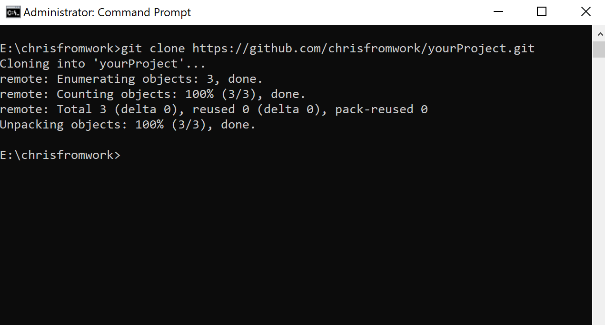
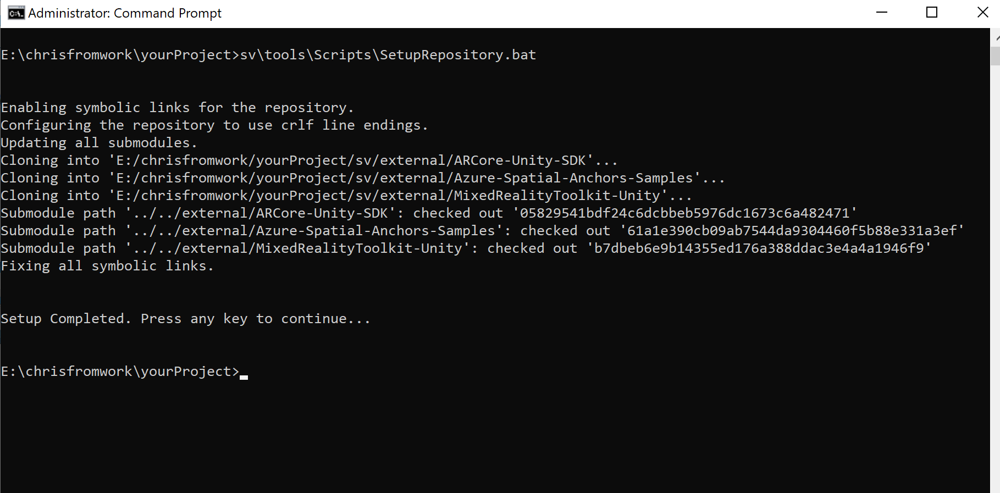
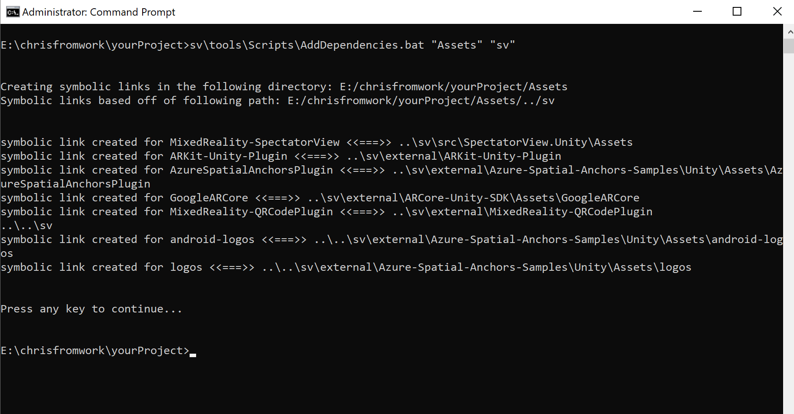
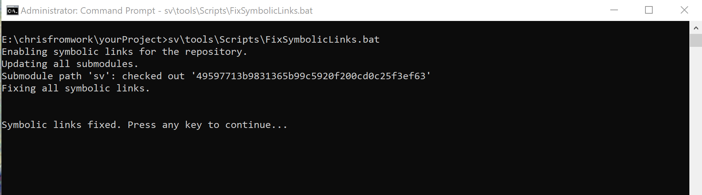

# Spectator View

Spectator View is an augmented reality product that enables viewing HoloLens experiences from secondary devices. Spectator View has multiple configurations and supports a variety of scenarios from filming quick prototypes to producing keynote demos.

## Samples

The Spectator View repository contains multiple sample projects. **The instructions for building and running samples will differ from instructions for adding the Spectator View codebase to your own project.** To see how to set up samples go [here](samples/README.md). To add Spectator View to your own project, see below.

## Getting started with your own project

### Obtaining the code

**Currently, the supported process for obtaining and consuming Spectator View code is by adding the repository as a submodule to your project** Downloading source code from the releases tab is possible, but helper scripts and sample projects may break if you choose not to reference the codebase as a submodule. Steps for cloning and using the git repository are as follows:

1. Download [git](https://git-scm.com/downloads)
2. Setup a repository for your project. For more information on how to setup a repository, see [here](https://help.github.com/en/articles/create-a-repo).
3. Open an administrator command window.
4. Clone your project's repository.

5. Change directories to that of your project's repository.
6. Add the MixedReality-SpectatorView codebase as a submodule for your project by running `git submodule add https://github.com/microsoft/MixedReality-SpectatorView.git sv`

>Note: If you are anticipating contributing to the MixedReality-SpectatorView project, you should fork your own version of the repository and add it as a submodule instead of the Microsoft repository. Your forked repository url will look something like this: `https://github.com/YourGitHubAliasHere/MixedReality-SpectatorView.git`.

7. Change directories to the MixedReality-SpectatorView submodule.
8. Choose the appropriate branch that you would like to use for the MixedReality-SpectatorView submodule. By default, the submodule will be directed at master, which may not be the most stable branch for consumption. To change branches run the following commands:

    1. Change directories into the submodule.
    2. Run `git fetch origin release/1.1.0`
    3. Run `git checkout release/1.1.0`
    4. Run `git branch` to make sure you are using the release/1.1.0 branch

After running these git commands, you will have a local copy of the MixedReality-SpectatorView codebase. Next, you will need to follow the instructions in `Setup your local environment` to obtain external dependencies.

### Setting up your local environment

The MixedReality-SpectatorView repository uses Unity packages, git submodules and symbolic linked directories for obtaining and referencing external dependencies. Prior to opening any Unity projects, you will need to run a setup script.

* The setup script will configure your git repository to use clrf line endings and support symbolic linked directories.
* The setup script will obtain and update all git submodules declared in the MixedReality-SpectatorView repository.
* The setup script will fix any symbolic linked directories in the MixedReality-SpectatorView repository.

> Note: Some of the external repositories we reference through git submodules may not have the same MIT `LICENSE` as the MixedReality-SpectatorView repository. Submodules in this project currently include: [MixedRealityToolkit-Unity](https://github.com/microsoft/MixedRealityToolkit-Unity), [Azure-Spatial-Anchors-Samples](https://github.com/Azure/azure-spatial-anchors-samples) and [ARCore-Unity-SDK](https://github.com/google-ar/arcore-unity-sdk). You should review the license of each of those repositories. These repositories will be pulled down to your computer when you run `tools/Scripts/SetupRepository.bat` script, or any of the `git submodule` related commands directly.

Depending on what release you are using the correct setup script may vary. Choose the appropriate script below based on the git branch that you have checked out in your clone of the MixedReality-SpectatorView repository.

1. Run `'tools/Scripts/SetupRepository.bat'` as an administrator on your PC (On Mac or Linux, you can run `'sh /tools/scripts/SetupRepository.sh'`). These scripts are located within your MixedReality-SpectatorView submodule.

### Adding references to your own project

After setting up a submodule for the MixedReality-SpectatorView repository and resolving its external dependencies (see above), the suggested mechanism for referencing the code is by adding symbolic linked directories to your Unity project's Assets folder. You can do this with the following:

> Note: Symbolic linked directories should be setup as relative paths. Using relative paths should allow directories to resolve correctly regardless of where you or your team members clone your project repository in their local file systems. The instructions below demonstrate setting up symbolic linked directories based on the following paths:
>* **Project repository directory:** c:\Your\Unity\Project
>* **Project Assets directory:** c:\Your\Unity\Project\Assets
>* **MixedReality-SpectatorView submodule directory:** c:\Your\Unity\Project\sv

1. Close any instances of Unity.
2. Open an administrator command window.
3. Run `tools\Scripts\AddDependencies.bat -AssetPath "Assets" -SVPath "sv"` (These paths are the relative paths to your project Assets folder and your MixedReality-SpectatorView submodule from the root directory of your repository).  This script is located within your MixedReality-SpectatorView submodule.

Now, when you reopen your project in Unity, folders should appear in your project's Assets folder.

### Sharing the project

After adding the MixedReality-SpectatorView repository as a submodule, you can commit the symbolic linked directories and submodule meta files to your repository to share with your team. If a team member wants to then use this repository they should do the following:

1. Clone the project repository.
2. Run `tools\Scripts\SetupRepository.ps1` in the MixedReality-SpectatorView submodule.
3. Run `tools\Scripts\FixSymbolicLinks.ps1` from the root directory of your project's repository.

### Basic Unity Setup

Below are quick instructions for adding Spectator View to your project:

1. Ensure you have all of the [Software & Hardware](doc/SpectatorView.Setup.md) required for building and using Spectator View.

2. Go through the `Getting Started` steps above to obtain and reference the MixedReality-SpectatorView codebase in your project.

3. Add the `MixedReality.SpectatorView/SpectatorView/Prefabs/SpectatorView.prefab` to the primary scene that will run on your HoloLens device. This prefab contains the bulk of Spectator View code for synchronizing and aligning holograms across multiple devices.

4. Choose a [Spatial Alignment Strategy](src/SpectatorView.Unity/Assets/SpatialAlignment/README.md) that will allow multiple devices to view holograms in the same location in the physical world. There are different mechanisms for achieving alignment, such as [Azure Spatial Anchors](https://azure.microsoft.com/en-us/services/spatial-anchors/) and marker detector based approaches. Not all approaches work for all devices, so you will need to pick the strategy that best addresses your needs.

5. Add the [dependencies](doc/SpectatorView.Setup.md) required for your Spatial Alignment Strategy to your Unity project. This may involve updating git submodules, adding symbolic linked directories, and manually downloading and extracting zip files. With the end of this step, you will have all of the needed code from external projects included in your Unity project.

6. Update your Unity project and player settings based on the [requirements](doc/SpectatorView.Setup.md) of your Spatial Alignment Strategy. This often involves adding preprocessor directives to different platform player settings to enable code paths specific to your desired Spatial Alignment Strategy.

7. Generate and check-in Asset Caches to your project repository. These Asset Caches act as GameObject registries and will allow different devices running your application to understand what Unity GameObjects are being created, destroyed and updated throughout the application life cycle. To generate these asset caches, run [Spectator View -> Update All Asset Caches](doc/SpectatorView.Setup.md) in the Unity Editor toolbar.

8. Build & Deploy your primary scene to the HoloLens device.

9. Open the example spectating scene appropriate for your mobile device type. This should either be `SpectatorView.Android.unity`, `SpectatorView.iOS.unity` or `SpectatorView.HoloLens.Spectator.unity`.

    > Note: If you are creating your own spectating scene, ensure that the `Role` property of the `SpectatorView` game object is set to `Spectator`; and the property `Shared Coordinate Origin` on `SpectatorView > SpatialCoordinateSystem > CameraTransform` game object is set to the parent game object of the main camera.

10. Build & Deploy your spectating scene onto your mobile device. Be sure to include the `SpectatorView.Android.unity`, `SpectatorView.iOS.unity` or `SpectatorView.HoloLens.Spectator.unity` scene in your build through the Build Settings. Platform specific build instructions can be found [here](doc/SpectatorView.Setup.md) for Android and iOS.

### Detailed Unity Setup
For more information on setting up a Spectator View project, see the following pages:

* [Spectating with an Android, an iOS or a HoloLens device](doc/SpectatorView.Setup.md)
* [Spectating with a video camera](doc/SpectatorView.Setup.VideoCamera.md)

## Architecture

For more information on Spectator View's architecture, see [here](doc/SpectatorView.Architecture.md).

## Debugging

For more information on debugging Spectator View, see [here](doc/SpectatorView.Debugging.md)

## Filing feedback

The easiest way to file feedback is by [opening an issue](https://github.com/microsoft/MixedReality-SpectatorView/issues). When filing feedback, please include the following information (when applicable):

1) Whether you're using a HoloLens or HoloLens 2 device
2) Development PC Windows Version
3) Unity Version
4) Whether you are building with .Net, Mono or il2cpp in Unity
5) Visual Studio Version
6) Windows SDK Version
7) iOS device type/iOS Version
8) Mac OS Version
9) Android device type/Android OS Version
10) Android Studio Version

In addition to opening issues, Spectator View contributors are active on [Stack Overflow](https://stackoverflow.com/). Use the [MRTK tag](https://stackoverflow.com/questions/tagged/mrtk) when asking Spectator View related questions.

## Contributing

This project welcomes contributions and suggestions.  Most contributions require you to agree to a
Contributor License Agreement (CLA) declaring that you have the right to, and actually do, grant us
the rights to use your contribution. For details, visit <https://cla.microsoft.com>.

When you submit a pull request, a CLA-bot will automatically determine whether you need to provide
a CLA and decorate the PR appropriately (e.g., label, comment). Simply follow the instructions
provided by the bot. You will only need to do this once across all repos using our CLA.

This project has adopted the [Microsoft Open Source Code of Conduct](https://opensource.microsoft.com/codeofconduct/).
For more information see the [Code of Conduct FAQ](https://opensource.microsoft.com/codeofconduct/faq/) or
contact [opencode@microsoft.com](mailto:opencode@microsoft.com) with any additional questions or comments.
