# Spectator View Video Camera Setup

Documentation below highlights the process of setting up a Video Camera filming experience. For more information on Spectator View Video Camera usage and supported functionality see [here](../src/SpectatorView.Unity/Assets/SpectatorView/Scripts/Compositor/README.md).

## Requirements

> Note: Video camera filming currently requires a HoloLens 2 for the camera rig. HoloLens 1 devices are not supported.

1. HoloLens 2 (This device will be needed in addition to the device worn by the user)
2. Windows PC
3. Visual Studio 2017 installed on the PC
4. Windows 10 SDK (10.0.18362.0)
5. Unity installed on the PC
6. A video camera that outputs 1080p video over SDI or HDMI (Capture cards supported below require HDMI, so you may also need a SDI to HDMI converter)
7. Blackmagic Design Intensity Pro 4K or Elgato HD 60S (Capture Cards)
8. 3D Printed or machined HoloLens 2 Camera Mount (see `doc/models/HoloLens2CameraMount/`)
    - 4 - 8-32 x 1-1/4 inch screws (Attaches body.STL to mount.STL)
    - 4 - 8-32 inch wing nuts (Attaches body.STL to mount.STL)
    - 1 - 10-24 x 6 inch threaded rod (Attaches two components in body.STL)
    - 2 - 10-24 inch wing nut (Attaches two components in body.STL)
    - 1 - 1/4-20 x 6 inch threaded rod (Attaches mount.STL to the camera, you may need camera hot shoe mount instead depending on your video camera)
    - 2 - 1/4-20 rod coupling nuts (Attaches mount.STL to the camera, you may need camera hot shoe mount instead depending on your video camera)
    - 1 - 1/4 x 2 inch camera hot shoe mount (Attaches mount.STL to the camera, you may need threaded rod instead depending on your video camera)
    - 1 - 1/4-20 inch hex nut (Attaches mount.STL to the camera, you may need threaded rod instead depending on your video camera)

>Note: When assembling the HoloLens 2 Camera Mount, be careful with the clamp.STL component. Consider sanding the poles on body.STL to prevent the clamp.STL from getting stuck/breaking.

# Calibration

Video camera filming relies on a physically mounted HoloLens 2 device generating position and orientation information for your video camera in the shared application space. This allows the Unity editor to understand where the video frame was filmed from in order to generate and composite Holograms into the feed. To get accurate tracking of your video camera in the physical world, you need to calculate the physical transform between the HoloLens 2 device and the video camera sensor. This is achieved through calibration.

The below instructions assume that you have already gone through the repository setup instructions [here](../README.md#getting-started-with-your-own-project) to obtain and reference the Spectator View codebase.

## Setup

1. Build x64 Release versions of SpectatorView.Compositor.dll & SpectatorView.Compositor.UnityPlugin.dll based on the instructions [here](../src/SpectatorView.Native/ReadME.md).
2. Build a x64 Release version of SpectatorView.OpenCV.dll based on the instructions [here](../src/SpectatorView.Native/ReadME.md).
3. Copy these Dlls to the SpectatorView.Unity project by running `tools/Scripts/CopyPluginsToUnity.bat`.
4. Download the [MixedReality QR Code Plugin](https://github.com/dorreneb/mixed-reality/releases) zip folder and extract its contents into the `external/MixedReality-QRCodePlugin` folder.
5. Print the [Chessboard](images/Chessboard.png) used to calculate video camera intrinsics and mount it to a solid surface.

>Note: This can be obtained by printing two copies of `doc/images/HalfChessboard.pdf` on 8.5x11 sheets of paper.

6. Print the [Calibration Board](images/CalibrationBoard.png) used to calculate video camera extrinsics and mount it to a solid surface.

>Note: This can be obtained by printing all of the `CalibrationBoard*.pdf` files in the `doc/images` folder on 8.5x11 sheets of paper. If you choose to print your own board using [CalibrationBoard.png](images/CalibrationBoard.png), make sure that each QR Code is larger than 5cm in length.

This [Calibration Board](images/CalibrationBoard.png) contains 18 QR Codes and ArUco markers pairs that are at known pixel distances from one another. With these marker pairs, calibration logic can use QR Code detection on the HoloLens 2 and ArUco detection in the editor to determine where ArUco markers in the video camera frame are in the physical world. **When printing this board, markers need to be larger than 5cm in length. It's also important to keep these marker pairs on the same page when printing so that their pixel distances from one another are maintained. The orientation of these pairs relative to other pairs does not need to be maintained (meaning, each marker pair can get printed on its own sheet of paper, but both the QR Code and ArUco marker in a pair should be printed on the same page at the same relative distance that they are at in the board).**

7. On your HoloLens 2 device, disable sign in. This can be achieved by going to 'Settings -> Sign-in options'. For 'Require sign-in', select 'Never'.

8. Setup the [device portal](https://docs.microsoft.com/en-us/windows/uwp/debug-test-perf/device-portal-hololens) for your HoloLens 2 device. To see how to setup device portal, look [here](https://docs.microsoft.com/en-us/windows/uwp/debug-test-perf/device-portal-hololens).

9. Connect your HoloLens 2 to Wi-Fi and obtain its IP address. This can be done through the settings application on the device. Go to Settings -> Network & Internet -> Wi-Fi -> Hardware properties to obtain the device's IP address.
10. Deploy the HolographiCamera.Unity project to your HoloLens 2 device.
    1. Open the `src/HolographicCamera.Unity` project.
    2. Open the HolographicCamera Unity scene in the project.
    3. In the WSA Unity player settings, add the **QRCODESTRACKER_BINARY_AVAILABLE** preprocessor directive. (This is located via Build Settings -> Player Settings -> Other Settings -> 'Scripting Defined Symbols
    4. Build and deploy this project to your HoloLens 2 device.

11. Test QR Code detection for the SpectatorView.HolographicCamera app deployed in step 7.
    1. Build and Deploy the SpectatorView.HolographicCamera app to your device (see step 7).
    2. Open the SpectatorView.Example.Unity project.
    3. Open the SpectatorView.ExtrinsicsCalibration Unity scene.
    4. Open the Calibration window in the Unity Editor. This can be found in the toolbar under 'Spectator View' -> 'Calibration'.
    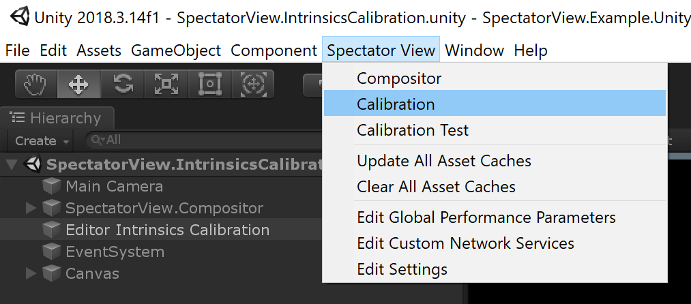
    5. Run the SpectatorView.ExtrinsicsCalibration Unity scene in the editor.
    6. Connect to your HoloLens 2 device by specifying its IP address in the Holographic Camera text field and pressing 'Connect'.
    7. Press 'Request Marker Data' to kick off QR Code detection.
    8. View your printed [Calibration Board](images/CalibrationBoard.png) through the HoloLens 2 device and make sure that blue and green squares appear over the QR Codes and ArUco markers (This may require getting the HoloLens 2 extremely close to the calibration board. 5cm QR Codes need to be detected from a distance of 10cm).

>Note: Don't skip this testing step. You will need to accept the webcam permission dialogue that is launched when first attempting QR Code detection with the newly installed SpectatorView.HolographicCamera application. Once the HoloLens 2 is attached to the video camera rig, it will be extremely difficult/impossible to accept these dialogues without dismantling your rig.

12. Attach your video camera to the PC capture card and ensure that the camera stream works.
    1. Attach your video camera by HDMI or SDI to the capture card hooked up to your PC.
    2. Turn on your video camera.
    3. Open the SpectatorView.Example.Unity project.
    4. Open the SpectatorViewCompositor Unity scene in the Unity Editor.
    5. Open the Compositor window in the Unity Editor. This can be found in the toolbar under 'Spectator View' -> 'Compositor'.
    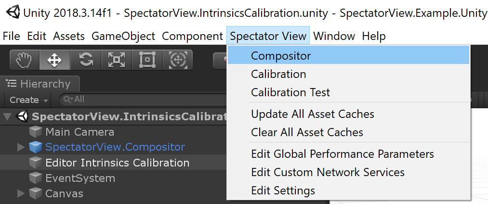
    6. Run the SpectatorViewCompositor scene in the Unity Editor.
    7. You should see the Camera Feed appear in the Compositor window if everything has been configured correctly.

13. Attach your HoloLens 2 device to the video camera using the HoloLens 2 camera mount (Coming soon...)

## Camera Intrinsics

Camera intrinsics quantify focal lengths, principal points and lens distortion information for your video camera. For video camera filming, camera intrinsics are used to calculate the Unity camera's projection matrix for the hologram feed. This then allows the hologram feed to be composited with the video camera feed. For more information on camera intrinsics, see [here](https://en.wikipedia.org/wiki/Camera_resectioning).

>Note: For best results, use a bright external light to illuminate your chessboard and calibration board. Set your lens's aperture to the smallest aperture (largest f-stop value) for which images still are exposed enough to see the marker pattern. Smaller apertures increase the depth of field and will allow for less focus blur when capturing images at different depths. **Both during and after calibrating a video camera rig, you should avoid changing the video camera's lens zoom/focal length. Changing zoom/focal length will invalidate calibration data.**

1. Open the SpectatorView.Example.Unity project.
2. Open the Calibration window in the Unity Editor. This can be found in the toolbar under 'Spectator View' -> 'Calibration'.

3. Open the SpectatorView.IntrinsicsCalibration Unity scene.
4. Update the Editor Intrinsics Calibration serialized fields in the Unity Inspector. You will need to update the Chessboard Width, Chessboard Height and Chess Square Size values to reflect the Chessboard print that you obtained during setup.

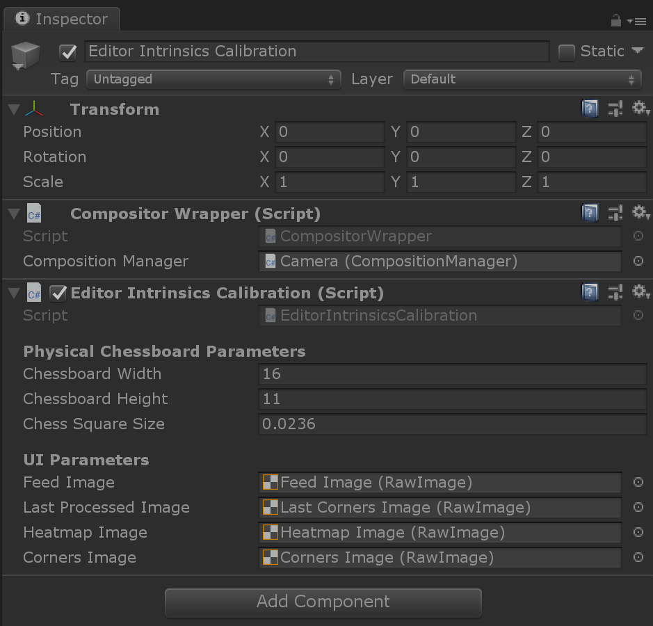

5. Run the SpectatorView.IntrinsicsCalibration Unity scene in the Unity Editor.

>Note: EditorIntrinsicsCalibration does not currently delete obtained Chessboard images with each subsequent run of the SpectatorView.IntrinsicsCalibration Unity scene. If you are calibrating a new video camera or have changed the focal length of the video camera, you will want to manually delete the Calibration folder in your Documents folder prior to running this scene.

6. Begin taking photos of the Chessboard with your video camera through the Unity Editor. To capture a photo Either press 'Take Photo' in the calibration window or select the 'Game' window and press 'Space' on your keyboard.

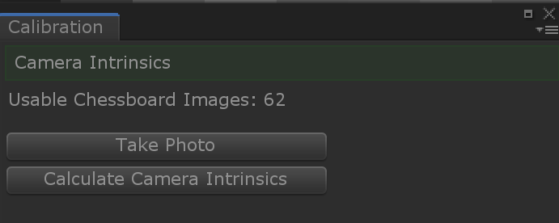

For each obtained image, EditorIntrinsicsCalibration will attempt to detect the chessboard. If the chessboard is found, it will be displayed in the detected chessboard image on the screen. The 'Usable Chessboard Images' count in the Calibration window will also be incremented.

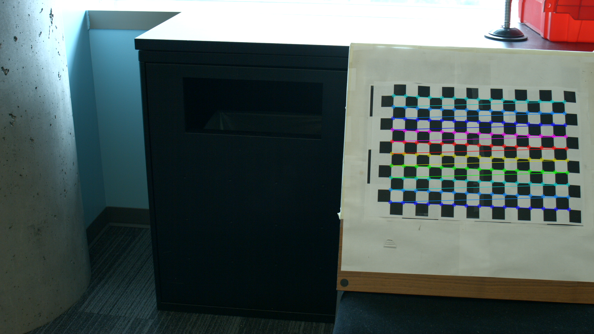

7. Continue obtaining images until you have obtained a sufficient number of chessboard feature points. Each image where the chessboard is detected will result in (Chessboard Width - 1) x (Chessboard Height - 1) feature points. You can obtain better calibration results by obtaining more chessboard feature points at different locations. You also want to have an even distribution of chessboard feature points throughout the video camera frame. The distribution of chessboard feature points can be observed based on Chessboard Heatmap and Chessboard Corners images that are also shown in the Unity scene. Examples of Chessboard Heatmap and Chessboard Corners with even distribution are shown below.

Chessboard Heatmap
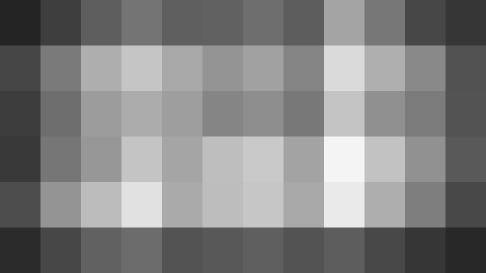

Chessboard Corners
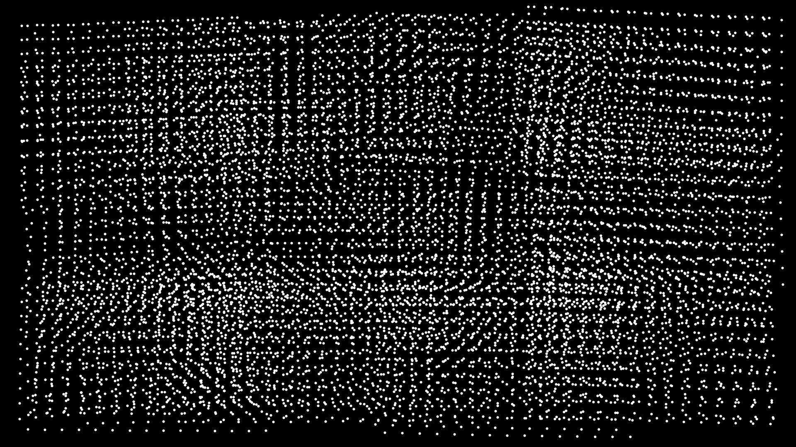

8. After obtaining enough Chessboard feature points, Press 'Calculate Camera Intrinsics' in the Calibration window or 'Enter' on your keyboard to calculate camera intrinsics.

>Note: Calculating camera intrinsics may take a while and take control of the UI thread for the Unity Editor.

9. Locate the output CameraIntrinsics*.json file on your computer. This file, as well as the images used to calculate camera intrinsics should be located in a 'Calibration' folder within your 'Documents' folder.

## Camera Extrinsics

Camera extrinsics are used to calculate the physical transform from your HoloLens 2 device to the video camera. When filming with the video camera, the HoloLens 2's position and orientation is provided to the Unity Editor. This position and orientation can then be transformed using the camera extrinsics to understand where the video camera is in the scene. The process for obtaining camera extrinsics is explained below.

1. Open the SpectatorView.Example.Unity project.
2. Open the Calibration window in the Unity Editor. This can be found in the toolbar under 'Spectator View' -> 'Calibration'.

3. Open the SpectatorView.ExtrinsicsCalibration Unity scene.
4. Update the Editor Extrinsics Calibration serialized fields in the Unity Inspector. You will need to set the Camera Intrinsics Path to the CameraIntrinsics*.json file that you created in the previous Camera Intrinsics steps.

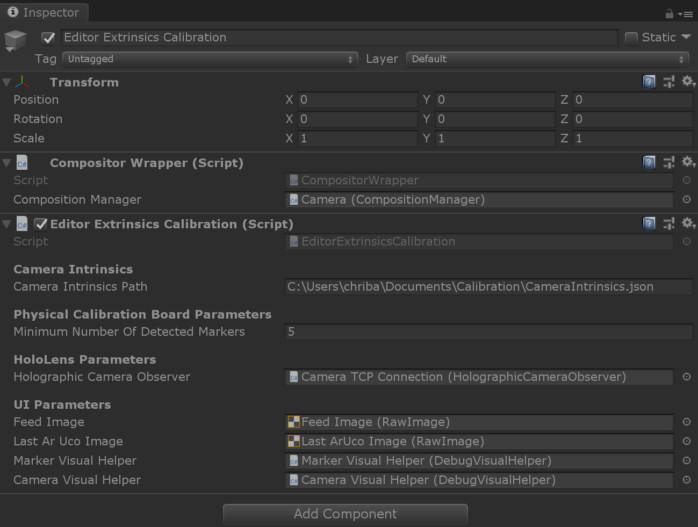

5. Run the SpectatorView.ExtrinsicsCalibration Unity scene in the Unity Editor.

>Note: EditorExtrinsicsCalibration does not currently delete Calibration board datasets with each subsequent run of the SpectatorView.ExtrinsicsCalibration Unity scene. You likely will get worse calibration results mixing old extrinsics datasets with new extrinsics datasets. Consider deleting HEADSET_DATA, DSLR_ARUCO and DSLR_ARUCO_DETECTED folders in the Calibration folder within your Documents folder before running SpectatorView.ExtrinsicsCalibration.

6. Launch the SpectatorView.HolographicCamera app on your HoloLens 2 device through the device portal.
7. Specify your device's IP address in the Calibration window and press connect.

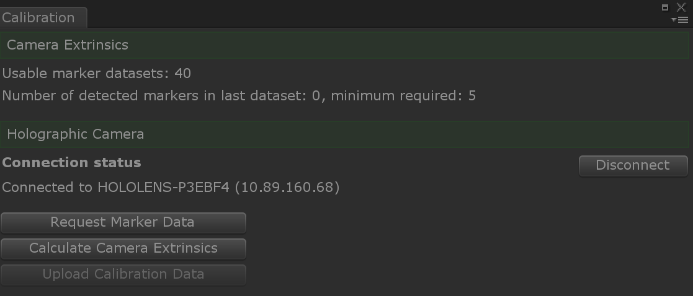

8. After connecting your device, press 'Request Marker Data' in the calibration window or press 'Space' on your keyboard when the Unity 'Game' window is in focus. This will kick off QR Code detection.

9. Take your HoloLens 2 and video camera rig and and detect all of the QR Codes on your printed Calibration Board. This may require getting the HoloLens 2 device close to the QR Codes. To determine whether all of the QR Codes have been detected, connect to your device through the device portal. Then, view the Mixed Reality Capture stream until green and blue squares have been placed over the QR Code and ArUco markers on the Calibration Board. This may require placing the HoloLens 2 device super close to the Calibration Board.

>Note: QR Code detection requires that the QR Codes are larger than 5cm. If the QR Codes are smaller than 5cm in length, you will need to reprint a larger board.

After detecting all of the markers, make sure the entire Calibration Board can be seen in the video camera stream. Then press 'Request Marker Data' or press the 'Space' key to obtain marker information from the HoloLens 2 device. The 'Usable marker datasets' count should be incremented. You can also see how many markers were detected in the last dataset relative to the minimum number of markers that are required for a dataset to be deemed usable.

10. After obtaining multiple marker datasets and Calibration Board images, press 'Calculate Camera Extrinsics' or the 'Enter' key when the Game window is in focus to calculate the camera extrinsics.

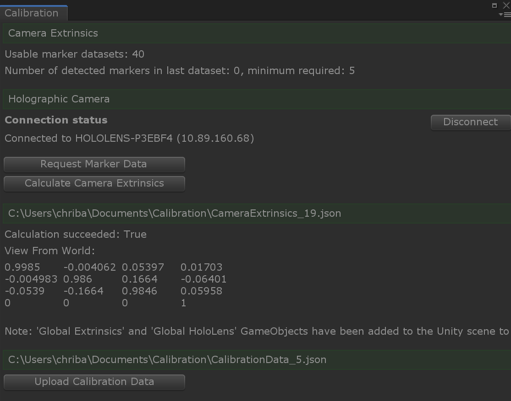

11. Look in the Calibration window to see whether or not the calculation succeeded. If the calculation did succeed, 'Global Extrinsics' and 'Global HoloLens' game objects will have been placed in your Unity scene. The difference in position and orientation of these prefabs should equate to the physical transform between your HoloLens device and the video camera. It will be used in filming to understand where your video camera is in the physical world relative to the HoloLens.

>Note: The physical transform you observe may be wildly off based on the quality of calibration data you obtained. If these values don't seem correct, you should go through the 'Testing Calibration' process below before uploading your calibration data to your HoloLens device.

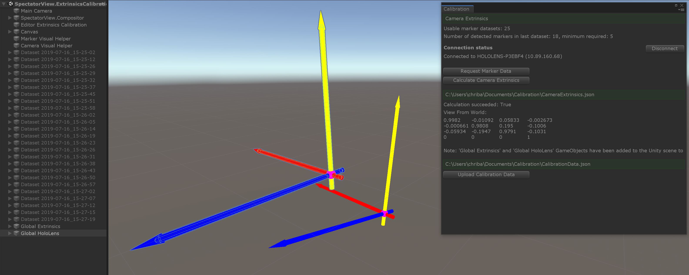

12. If your physical transforms look good, you can choose to upload your calibration file to the device by pressing 'Upload Calibration Data'.

>Note: Uploading calibration data to your device will overwrite any previously existing calibration data on the device. CalibrationData.json is stored in the Pictures Library on the HoloLens 2 device and can be manually managed through Device Portal's File Explorer. DO NOT press 'Upload Calibration Data' if you already have valid calibration data on your device and do not want to overwrite it.

13. After uploading a CalibrationData.json file to your HoloLens 2 device's Picture Library, you have completed calibration and can begin filming. However, calibration can generate varying results. It's suggested to test your calibration to ensure it achieves the quality required for your filming needs. Multiple calibration attempts may be required to obtain adequate results.

## Testing Calibration
It may take multiple attempts at calibration to obtain sufficient results for video camera filming. To assess different calibration results, you can use the 'Calibration Test' window provided in the Spectator View codebase. Instructions for using this window are as follows:

1. Print the following QR code at a size greater than 10cm.
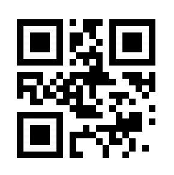
2. Build and deploy the SpectatorView.HolographicCamera application to your HoloLens device.
3. Open the SpectatorView.Example.Unity project.
4. Open the Calibration Test window in the Unity Editor. This can be found in the toolbar under 'Spectator View' -> 'Calibration Test'.
5. Open the SpectatorViewCompositor unity scene in the Unity Editor.
6. Run the SpectatorViewCompositor scene in the Unity Editor.
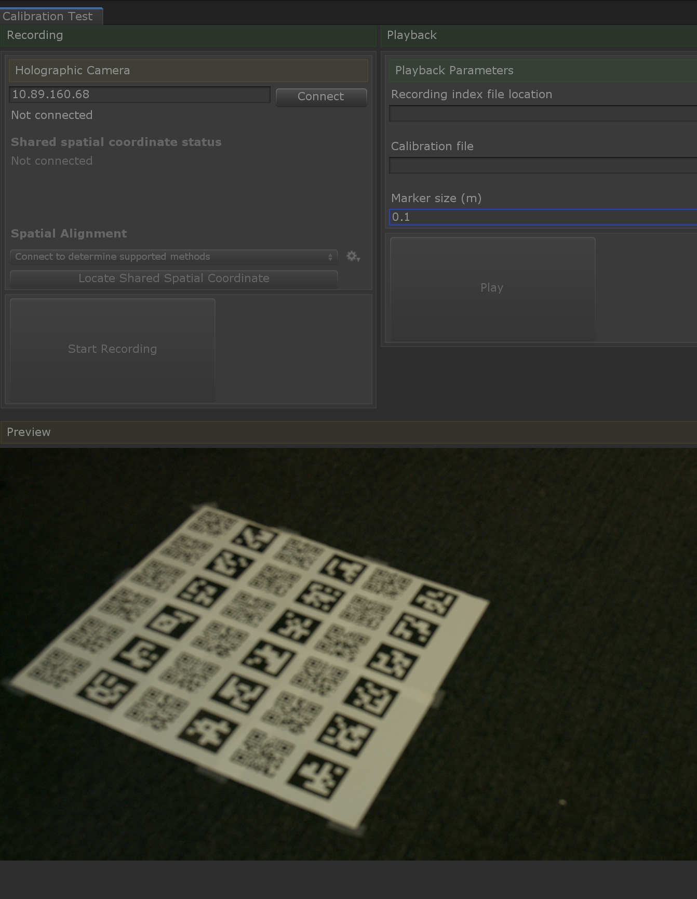
7. Connect to your HoloLens device using the 'Calibration Test' window.
8. Locate a shared spatial coordinate using the 'QR Code" localization strategy.
9. Once you have located the shared spatial coordinate, press 'Start Recording'.
10. Begin filming the printed QR Code.
11. After obtaining some footage of the QR Code, press 'Stop Recording'. This should populate the 'Recording index file location'.
12. Specify the 'Calibration file' that you would like to use for testing.
13. Measure the physical length of your printed QR Code, and set the 'Marker size (m)' field to this value (Note: this value should be in meters).
14. Press 'Play' in the 'Calibration Test' window.
15. A cube will be placed in the scene on top of your printed QR Code. The accuracy of this placement when moving around your video camera allows for a subjective assessment of whether or nto the calibration will suffice for your needs.
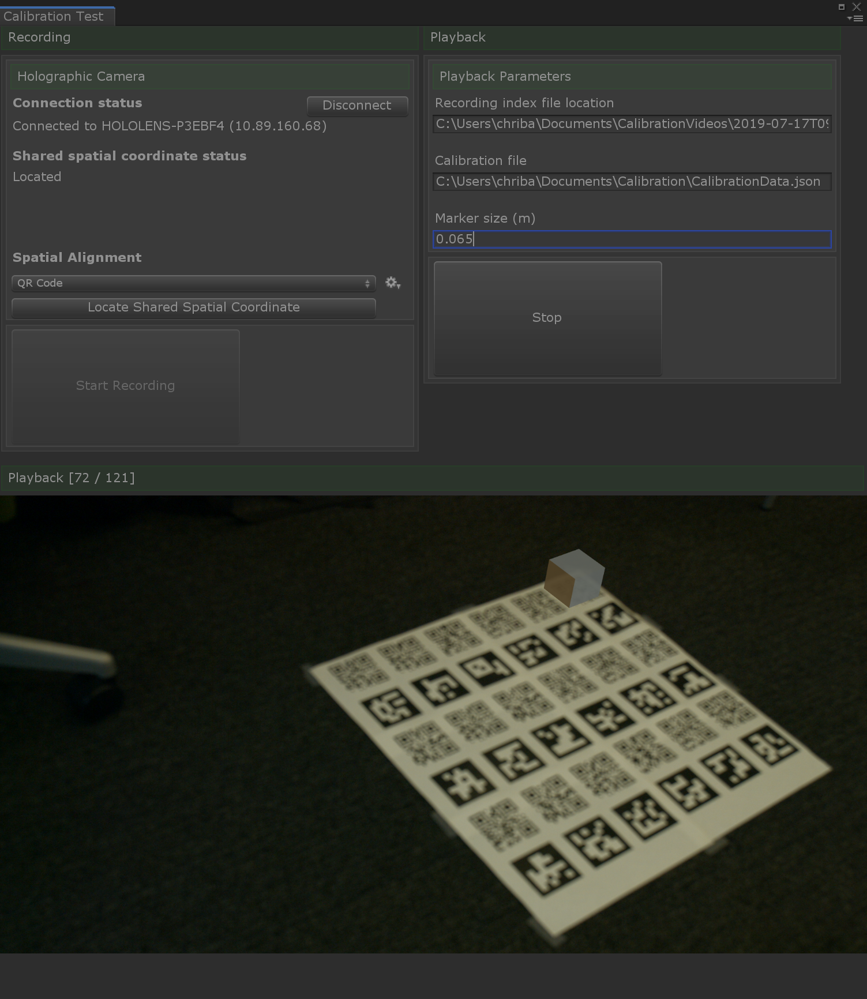

## Uploading Calibration Data
If you chose not to immediately upload your calibration data to your device or have tested multiple calibration data files, you can manually upload the one of your choosing by the following:

1. Open the [Device Portal](https://docs.microsoft.com/en-us/windows/mixed-reality/using-the-windows-device-portal) for your HoloLens 2 device.
2. Navigate to your HoloLens 2 Device's File explorer in the Device Portal. This can be found by going to 'System' -> 'File explorer'.
3. Rename your chosen CalibrationData*.json file to CalibrationData.json.
4. Upload this renamed CalibrationData.json file to the Pictures Library on your HoloLens device. This can be done by going to 'User Folders\Pictures'. Then you can upload the file.

# Filming
After you have calibrated your rig, you will be ready to film HoloLens experiences with your video camera. For more information on filming, see [here](../src/SpectatorView.Unity/Assets/SpectatorView/Scripts/Compositor/README.md).

# Troubleshooting

### __Issue:__ Elgato capture card failing to initialize
The Elgato HD 60S capture card requires USB 3.0 to work correctly. If the capture card is plugged into your PC with a non USB 3.0 cord/port, it will still register in Device Manager. However, it will fail to initialize with the Compositor when filming your application. Typically, you can more easily troubleshoot issues with your elgato capture card not initializing correctly in elgato supported software. To find elgato supported software to test your HD 60S capture card, look [here](https://www.elgato.com/en/gaming/downloads).