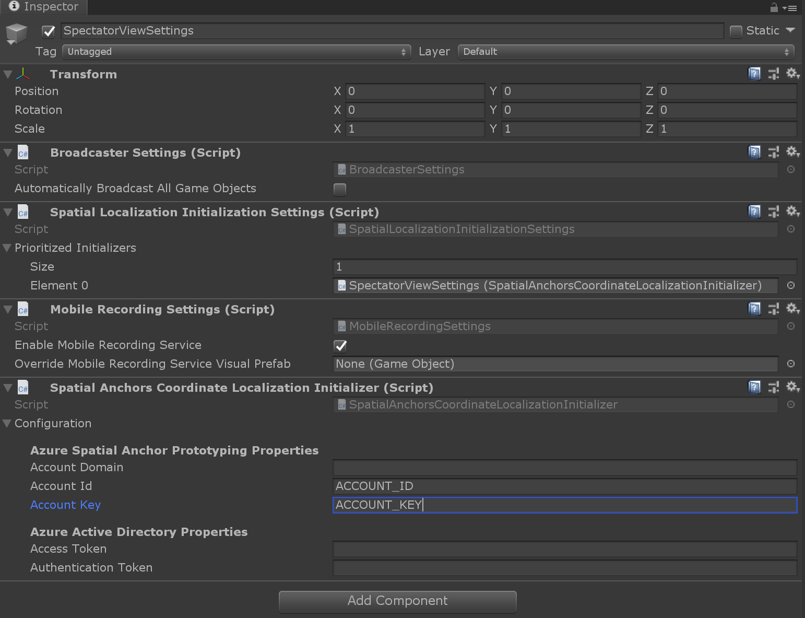
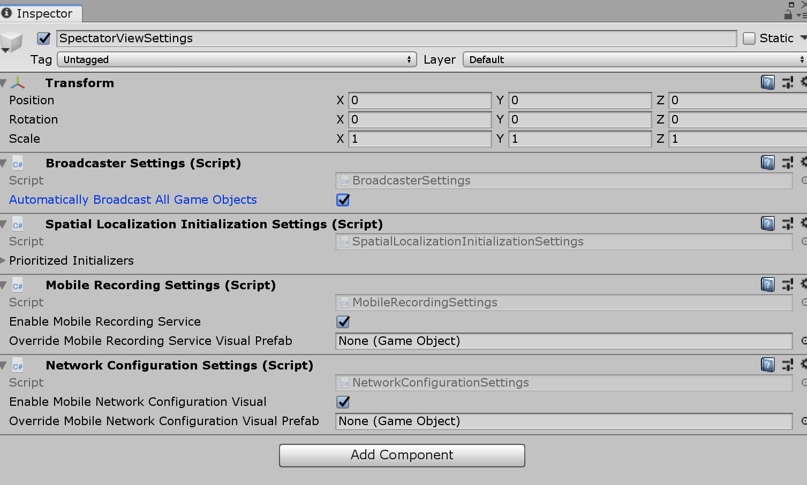
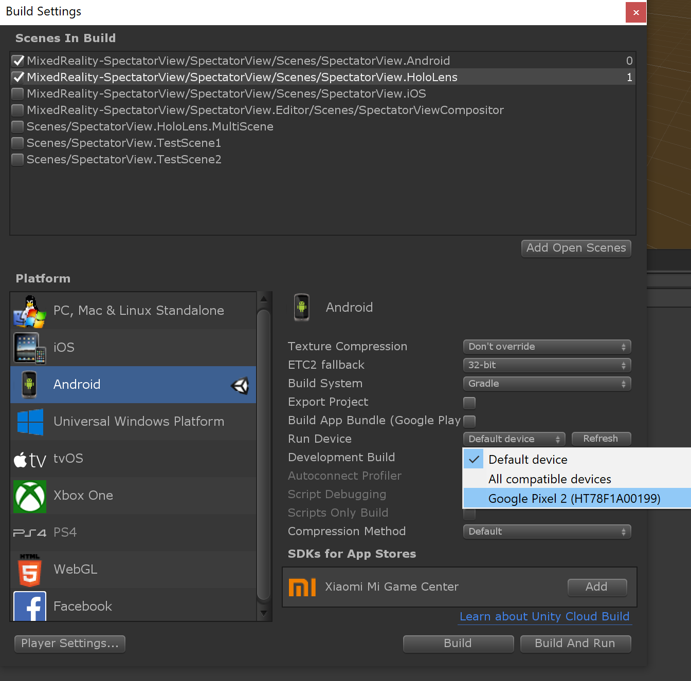
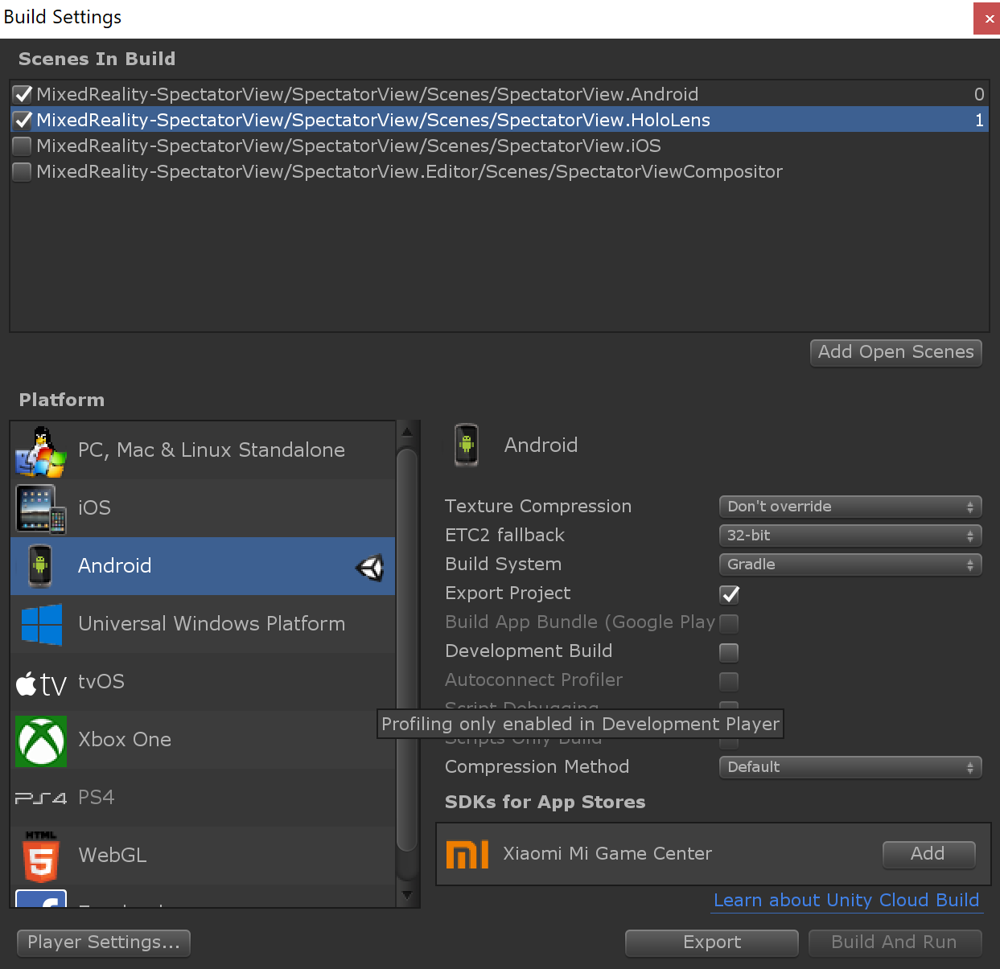

# Spectator View Mobile Setup
To setup spectator view with a video camera, see [here](SpectatorView.Setup.VideoCamera.md).

## Software & Hardware Requirements

### HoloLens 2 & HoloLens Requirements

1. Windows PC
2. HoloLens 2 or HoloLens
3. [Visual Studio 2019](https://visualstudio.microsoft.com/vs/) installed on the PC
    * Universal Windows Platform development tools (installed through visual studio installer)
    * Desktop development with C++ tools (installed through visual studio installer)
4. [Windows 10 SDK (10.0.18362.0)](https://developer.microsoft.com/en-us/windows/downloads/windows-10-sdk)
5. [Unity 2019](https://unity3d.com/get-unity/download) installed on the PC

### Android Requirements

1. Windows PC
2. Android Device that supports [AR Core](https://developers.google.com/ar/discover/supported-devices)
3. [Android Studio](https://developer.android.com/studio)
5. [Unity 2019](https://unity3d.com/get-unity/download) installed on your development device with [Android build support](https://docs.unity3d.com/Manual/android-sdksetup.html). This module can be included when first installing Unity, or you can use [Unity Hub to add the module](https://docs.unity3d.com/Manual/GettingStartedAddingEditorComponents.html) after installing.

### iOS Requirements

1. Mac
2. ARM64 iOS Device that supports [AR Kit](https://developer.apple.com/library/archive/documentation/DeviceInformation/Reference/iOSDeviceCompatibility/DeviceCompatibilityMatrix/DeviceCompatibilityMatrix.html)
3. [Unity 2019](https://unity3d.com/get-unity/download) installed on the Mac with [iOS build support](https://docs.unity3d.com/Manual/iphone-GettingStarted.html).  This module can be included when first installing Unity, or you can use [Unity Hub to add the module](https://docs.unity3d.com/Manual/GettingStartedAddingEditorComponents.html) after installing.
4. [XCode](https://developer.apple.com/xcode/) installed on the Mac
5. Obtain an [apple developer license](https://developer.apple.com/programs/enroll/)

# Preparing your project

To use the Spectator View codebase, follow the instructions [here](../README.md#getting-started-with-your-own-project) to obtain the com.microsoft.mixedreality.spectatorview.* Unity package.

## Spatial Alignment Strategy Dependencies

Spectator View requires multiple devices understanding a shared application origin in the physical world. In order to establish this shared application origin, you will need to choose and use a [spatial alignment strategy](../src/SpectatorView.Unity/Assets/SpatialAlignment/README.md#detailed-breakdown-of-spatial-alignment-strategies). You will only need to go through one setup process below for the spatial alignment strategy you choose.

Not all spatial alignment strategies support all platforms. See the chart below to determine which strategy best addresses your intended user scenarios.

| Platform  Support      | HoloLens 2 | HoloLens 1 | Android | iOS |
|:----------------------:|:----------:|:----------:|:-------:|:---:|
| Azure Spatial Anchors  | x          | x          | x       | x   |
| QR Code Detection      | x          |            | x       | x   |
| ArUco Marker Detection |            | x          | x       | x   |

### Azure Spatial Anchors

1. Setup an [Azure Spatial Anchors account](https://docs.microsoft.com/en-us/azure/spatial-anchors/quickstarts/get-started-unity-hololens) and obtain an `Account ID` and `Primary Key`.
2. Obtain [AzureSpatialAnchors](https://github.com/Azure/azure-spatial-anchors-samples/releases/tag/v1.1.1) dependencies. This can be achieved by running the `tools\Scripts\SetupRepository.bat` script as an administrator.
> Note: If your development environment does not support symbolic links, `tools\Scripts\SetupRepository.bat -HardCopySymbolicLinks` will replace symbolic links in the project with copied file content.
3. Create a `SpectatorViewSettings` prefab by calling 'Spectator View' -> 'Edit Settings' in the toolbar.

7. Add a `SpatialAnchorsCoordinateLocalizationInitializer` to this SpectatorViewSettings prefab. Update the Account ID and Account Key to be the Account ID and Primary Key values that you obtained in step 1. 
8. Update the `SpatialLocalizationInitializationSettings` Prioritized Initializers list to reference the `SpatialAnchorCoordinateLocalizationInitializer` you created.

> Note: Use of an Account Id and Account Key can accelerate your development process. However, hardcoding these values into your application isn't a safe practice and should be avoided for enterprise deployed solutions. For your end application, its suggested to use an Access or Authentication token. More information on how to setup and use AAD tokens with ASA can be found [here](https://docs.microsoft.com/en-us/azure/spatial-anchors/concepts/authentication?tabs=csharp#azure-ad-user-authentication).

### QR Code Detection

1. The dependencies required for QR Code detection should be obtained with `tools\scripts\CreateUnityPackages.bat`. Dlls should be located in `com.microsoft.mixedreality.spectatorview.*\SpectatorView.ExternalDependencies\UnityFiles`.

### ArUco Marker Detection

1. The dependencies required for ArUco detection should be built with `tools\scripts\CreateUnityPackages.bat`. Dlls should be located in `com.microsoft.mixedreality.spectatorview.*\SpectatorView.Native\Plugins`. You specifically need `WSA\x86\SpectatorView.OpenCV.dll` and its dependencies.

## Building & Deploying

### HoloLens 2 & HoloLens as the Host/User

1. Open the project scene that you intend to use with SpectatorView. 
2. Add the `SpectatorView` prefab to the scene.
3. Setup your scene to synchronize content. You can either have all content synchronized by checking 'Automatically Broadcast All Game Objects' in BroadcasterSettings located in your SpectatorViewSettings prefab. Or, you can manually add GameObjectHierarchyBroadcaster components to all parent game objects in the scene that you want synchronized.

4. Edit the state synchronization performance parameters in your application to monitor material property changes based on your applications needs (SpectatorView -> Edit Global Performance Parameters). For more information on performance tuning content synchronization, see [here](../src/SpectatorView.Unity/Assets/SpectatorView/Scripts/StateSynchronization/README.md).
5. Press the 'HoloLens' button on the `Platform Switcher` attached to `Spectator View` in the Unity inspector (This should configure the correct build settings and app capabilities).
6. Build and deploy the application to your HoloLens device.

### HoloLens 2 & HoloLens as a Spectator

1. Make sure your Unity project contains the asset caches that were created in the 'Before building' steps.
2. Open the `SpectatorView.HoloLens.Spectator` Unity scene.
3. Press the 'HoloLens' button on the `Platform Switcher` attached to `Spectator View` in the Unity inspector (This should configure the correct build settings and app capabilities).
4. Declare the `SpectatorView.HoloLens.Spectator` as the first scene included in your Unity Build settings. Include your main project scene as the second scene included in your Unity Build settings.
5. Build and deploy the application to your HoloLens device.

### Android

1. Make sure your Unity project contains the asset caches that were created in the 'Before building' steps.
2. Open the `SpectatorView.ARFoundation.Spectator` Unity scene.
3. Press the 'Android' button on the `Platform Switcher` attached to `Spectator View` in the Unity inspector (This should configure the correct build settings, app capabilities, and make sure you have a valid Android manifest file).

> Note: If you need to customize your Android manifest, you can make changes to `Assets/Plugins/Android/AndroidManifest.xml` before you build, or you can use the 'Export Project' build option in Unity and then edit `src/main/AndroidManifest.xml` in your Android Studio project.

4. Make sure to declare the SpectatorView.ARFoundation.Spectator scene as the first scene included in your Unity Build Settings. If SpectatorView.ARFoundation.Spectator does not exist in your list of scenes to choose from in the build settings, open the scene in the Unity editor. Then reopen the build settings and press 'Add Open Scenes'.

5. Add your Unity project's main scene as the second included scene in the Unity Build Settings. 

6. `Build and Run` the application through Unity's Build Settings. If you're targeting a new Android development device, you may need to enable developer options and debugging. For information on setting up your Android device for debugging, see [here](https://developer.android.com/studio/debug/dev-options).

> Note: You may need to the `Run Device` dropdown to find your desired Android device.
> 

### iOS

> Note: Building iOS applications requires a mac.

1. Open the `SpectatorView.ARFoundation.Spectator` Unity scene.
2. Press the 'iOS' button on the `Platform Switcher` attached to `Spectator View` in the Unity inspector (This should configure the correct build settings and app capabilities).
3. Build the iOS project to generate a XCode solution. Include the SpectatorView.ARFoundation.Spectator scene as the first scene in your Unity Build Settings. Add your project's main scene as the second scene in your Unity Build Settings. (If the scenes are missing from your Unity Build Settings, open the scene in the Unity editor and press 'Add Open Scenes' in the Unity Build Settings).
4. In the terminal, navigate to your xcode project folder.
5. Run `'pod install --repo-update'` in the terminal when in your xcode project folder.
6. Open and compile your application using the **xcode workspace**. Do NOT use the **xcode project**.
>Note: Failing to take the above steps may result in errors such as 'Undefined symbols for architecture arm64' and 'framework not found Pods_Unity_iPhone' For more information on building ASA for iOS in Unity see [here](https://docs.microsoft.com/en-us/azure/spatial-anchors/quickstarts/get-started-unity-ios).
7. Configure the [signing certificate](https://developer.apple.com/support/code-signing/) for your Unity generated project in XCode to reflect your developer account.
8. Build and deploy your project to your desired iOS device.

### Additional Notes
1. Spectator View introduces an additional build step to generate asset caches. Asset caches need to be regenerated every time a new asset is added to your project. These asset caches are essentially a registry that allows spectator devices to know what content to dynamically create, display and tear down based on actions of the user. If you have a lot of assets in your project, regenerating asset caches may take a long time. You can disable updating asset caches every build in favor of manually updating asset caches when needed by checking `Disable updating asset caches when building` under the `Spectator View` toolbar item. You will then need to run `Update All Asset Caches` under the `Spectator View` toolbar whenever you add new content to your project.
2. For Android builds, the Spectator View codebase needs to create a custom Android manifest and gradle files in order to pick up Azure Spatial Anchor dependencies. This launches a dialog during building, which may break automation. If you need to avoid these dialogues, you can check `Disable Spectator View Pre-build steps` under the `Spectator View` toolbar.

## Example Scenes

If you would like to try out an example before setting up your own application to work with spectator view, run `tools/Scripts/SetupRepository.bat` as an administrator. Then, open the `samples/SpectatorView.Example.Unity` project. You can then build and deploy the following scenes:

* HoloLens Host: `SpectatorView.HoloLens`
* HoloLens Spectator: `SpectatorView.HoloLens.Spectator`
* Android: `SpectatorView.ARFoundation.Spectator`
* iOS: `SpectatorView.ARFoundation.Spectator`

## Customizing UI

Spectator View contains some ability for customizing UI. For more information, see [here](../src/SpectatorView.Unity/Assets/SpectatorView/Scripts/UI/README.md).

## Troubleshooting

### __Issue:__ DirectoryNotFoundException: Could not find a part of the path "*.asmdef"
Spectator view uses symbolic linked directories in its sample projects, which results in large file paths. A DirectoryNotFoundException can occur if these file paths become too long. To fix this, place your Unity project in a directory with a shorter name, such as c:\proj.

### __Issue:__ Android screen recording fails to begin based on PERMISSION_DENIED
In some instances, contributors have experienced issues with android permissions after exporting their Unity project to Android Studio and declaring the ScreenRecordingActivity as their main activity in the AndroidManifest.xml. It's been observed that `android:maxSdkVersion=18` arguments can appear in the exported solution for the WRITE_EXTERNAL_STORAGE and READ_EXTERNAL_STORAGE user-permissions declared in their AndroidManifest. Removing `maxSdkVersion` declarations has unblocked users and allowed screen recording to work.

### __Issue:__ System.* types fail to resolve when first building a HoloLens visual studio solution generated from Unity
When first opening a visual studio solution generated from Unity for the Spectator View codebase, the build may fail. Typically after this first failure, an `Opening repositories` step will run and output to the visual studio console. Reattempting the build after this step has ran typically results in the solution succeeding to compile.

### __Issue:__ SetupRepository.sh did not work on Mac
Depending on your local environment, you may need to declare the SetupRepository.sh script as executable by changing its access permissions/mode. To do this, run the following commands:
- `cd tools/Scripts`
- `chmod a+x *.sh`
- `./SetupRepository.sh`

### __Issue:__ Unity fails to open your SpectatorView project on Mac
You may encounter issues when opening a Unity project based on read/write permissions for Project Packages. To fix this, you can run the following command in your Project's Packages folder (Note the below example is for the Build 2019 sample application):
- MixedReality-SpectatorView/samples/Build2019Demo.Unity/Packages$ `sudo chmod a+rwx *`

### __Issue:__ "Failed to change file flags" errors encountered when opening a Unity project on Mac
In some instances, file permissions may generate errors when opening a spectator view Unity project. To fix this, you can try running the following command:
- MixedReality-SpectatorView$ `sudo chmod a+rwx *`

### __Issue:__ Azure Spatial Anchors session fails to initialize on Android
Azure spatial anchors uses a custom gradle file, `mainTemplate.gradle`, in order to obtain external dependencies. Prior to release/1.0.3, helper scripts did not correctly setup the symbolic link required to include `mainTemplate.gradle` for new projects. Without this gradle file, initializing Azure Spatial Anchors will fail. To fix this issue, check in your project for `Assets/Plugins/Android/mainTemplate.gradle`. If it does not exist create a symbolic link or copy `mainTemplate.gradle` into an `Assets/Plugins/Android` folder in your Unity project. If this gradle file is in a nested Plugins folder (Not `Assets/Plugins/Android`), it may fail to get picked up correctly. You can test whether the correct gradle file was used by looking in your `build.gradle` definition within Android Studio. It should contain content similar to the `mainTemplate.gradle` distributed with the Azure Spatial Anchors submodule dependency.

### __Issue:__ Frame rate for HoloLens device drastically drops when a spectator device connects to the experience.
Scraping the entire Unity scene for content updates on the HoloLens device can be computationally expensive. You may find that you need to better tune your synchronization story to improve the overall experience. For information on how to tune your synchronization experience for better performance, see [here](../src/SpectatorView.Unity/Assets/SpectatorView/Scripts/StateSynchronization/README.md).

### __Issue:__ Transparent objects display incorrectly on Android or iOS devices.
Its been observed that different shader variants may not get correctly built into Android and iOS applications when only including the SpectatorView.ARFoundation.Spectator scene. For example, the standard shader may not end up with transparent variants included in the Android/iOS builds, causing transparent content to not display correctly on spectator devices. To fix this, its suggested to include your HoloLens scene in the Android/iOS build. You can do this by including the scene in your build settings (see below). Note that you will need to keep the SpectatorView.ARFoundation.Spectator scene has scene 0 in the build. You may also be able to fix this by including your desired shader in the Build-in Shader Settings (Edit -> Project Settings -> Graphics). You may also be able to fix this by creating a [ShaderVariantCollection](https://docs.unity3d.com/Manual/OptimizingShaderLoadTime.html).

### __Issue:__ Shaders don't compile for Android or iOS Unity Players
Shaders originally created to run on HoloLens may not immediately compile for Android or iOS. One common issue is that shader model 5.0 is not supported by OpenGL. To hide DirectX11 shader model 5.0 logic, you can use the below `#if defined(SHADER_API_D3D11)` (Note: In some instances, shaders may not appear correctly in the editor but will compile correctly for iOS and Android). For more information on shader target levels, see [here](https://docs.unity3d.com/Manual/SL-ShaderCompileTargets.html).

`#if defined(SHADER_API_D3D11)`

`#pragma target 5.0`

`#endif`

> Note: Unity has the ability to [emulate different graphics configurations](https://docs.unity3d.com/2018.3/Documentation/Manual/GraphicsEmulation.html) (Edit -> Graphics Emulation). Adjusting these settings may allow for testing your shaders for Android or iOS in the Editor.
