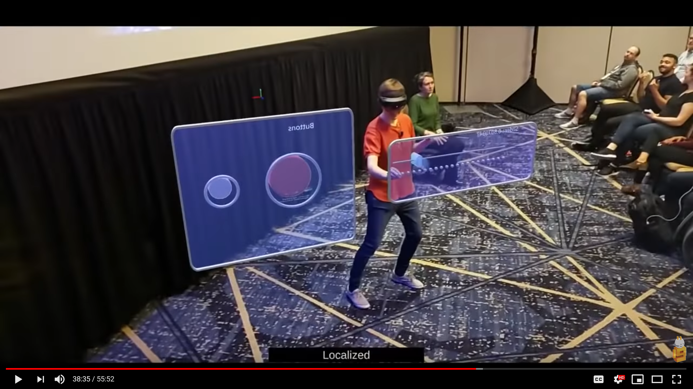
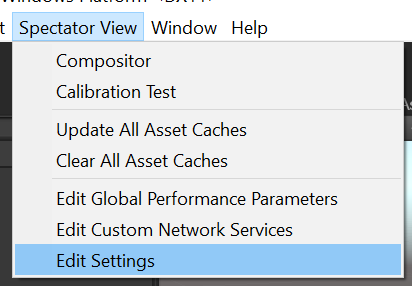
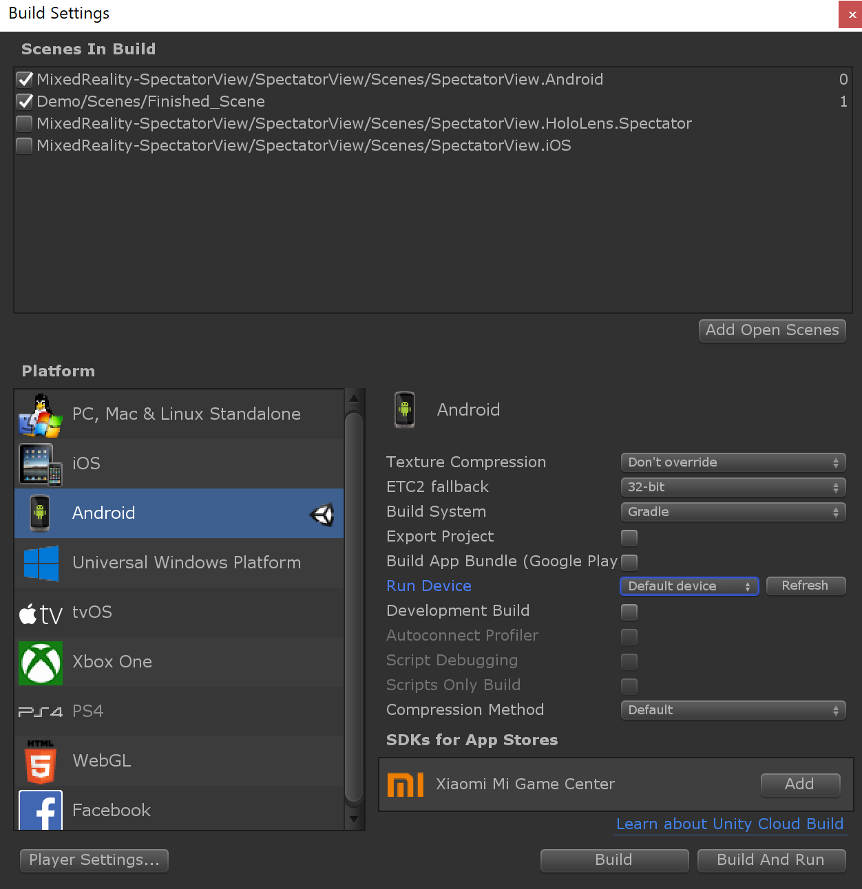
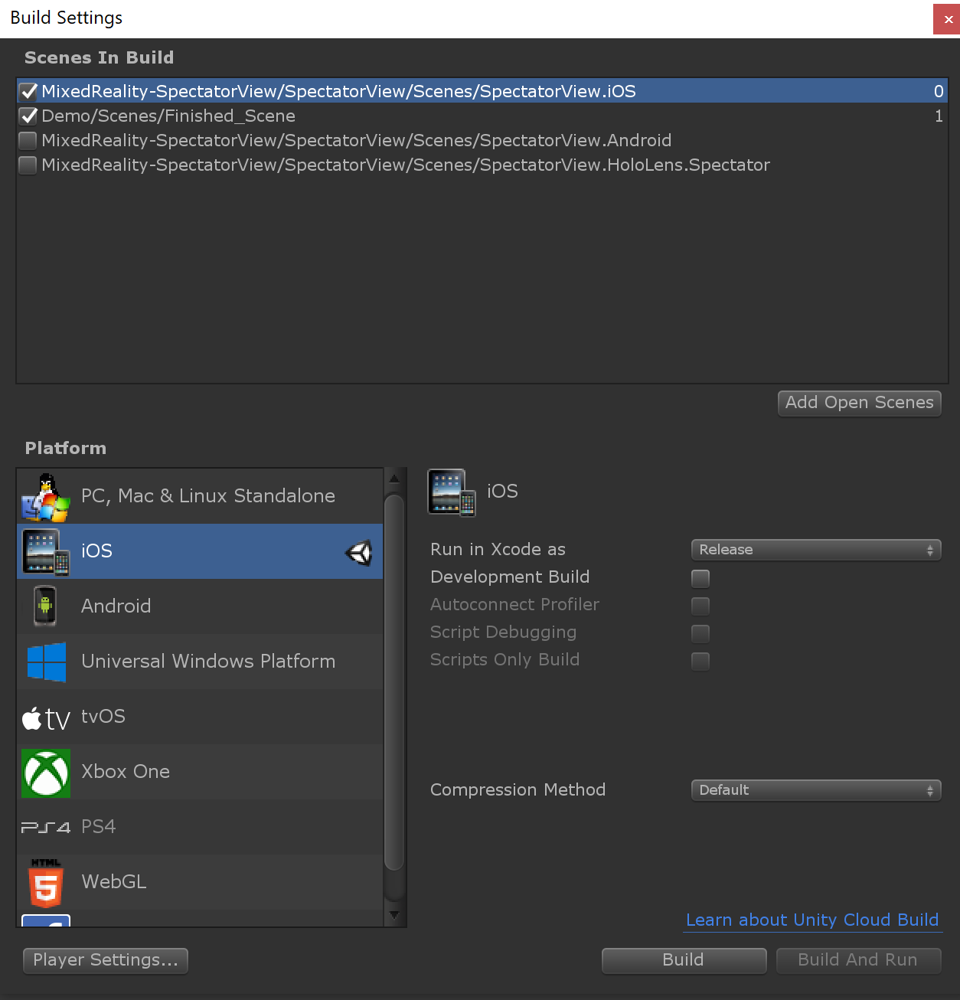

# //BUILD 2019 Demo

This sample of using SpectatorView is very similar to the live code demo presented at //BUILD 2019 conference. It showcases the [Azure Spatial Anchors](https://azure.microsoft.com/en-us/services/spatial-anchors/) alignment strategy.

## Running the Demo

In order to run the demo, you will need at least two MR/AR capable devices. You should ideally use a HoloLens or HoloLens 2 device to host and interact with the shared application experience. You can then use a mobile device to view the application experience. Once you have the devices ready, follow the instructions below.

> **ARKit Note:** If you wish to run the experience on an iOS device with ARKit, download the [ARKit repository](https://bitbucket.org/Unity-Technologies/unity-arkit-plugin/downloads/), unzip it, and copy the contents of the `Unity-Technologies-unity-arkit-plugin-94e47eae5954/Assets` folder to `/samples/Build2019Demo.Unity/Assets/`.

### Instructions

These instructions assume that a HoloLens 2 device will be used to host the shared experience and that a mobile device will be used to spectate the shared experience.

#### Prepare your local codebase

1. Run `tools/Scripts/SetupRepository.bat` (`tools/Scripts/SetupRepository.sh` on Mac) to setup your local version of the code base. This script will obtain the external dependencies required for building this project.

#### Prepare your devices

1. Connect your devices to the same WiFi network.
2. Obtain and write down your HoloLens's IP Address (This can be found in the settings menu).

#### Configure your project

1. Ensure you have created an [Azure Spatial Anchors](https://docs.microsoft.com/en-us/azure/spatial-anchors/quickstarts/get-started-unity-hololens#create-a-spatial-anchors-resource) account.
2. Open the Build2019Demo.Unity project in Unity.
    - If requested, import the TextMeshPro Essentials.
3. Open the `Finished_Scene` sample scene.
4. Run `Spectator View -> Update All Asset Caches` from the Unity toolbar.
5. Open SpectatorView settings by going to the menu `SpectatorView > Edit Settings`. \

6. Replace `ENTER_ACCOUNT_ID` and `ENTER_ACCOUNT_KEY` with your Account Id and Account Key obtained when setting up your Azure Spatial Anchors account. \

#### Build & Deploy

##### HoloLens 2

1. Select `HoloLens` as your target platform using Spectator View's `PlatformSwitcher` (This can be found in the Unity inspector for the `SpectatorView` prefab GameObject).
2. Build UWP Player containing `Demo/Scenes/Finished_Scene.unity` scene, and deploy this application to the HoloLens 2 device.
3. Launch the `SpectatorView.Build2019Demo` on the HoloLens 2, and wait for the experience to start.

##### Android

1. Select `Android` as your target platform using Spectator View's `PlatformSwitcher` (This can be found in the Unity inspector for the `SpectatorView` prefab GameObject).
2. `Build and Run` the Android Player containing `MixedReality-SpectatorView/SpectatorView/Scenes/SpectatorView.Android.unity`.
3. Launch the `SpectatorView.Build2019Demo` on the Android device and connect to the HoloLens device by specifying the HoloLens's IP Address.

##### iOS

1. Select `iOS` as your target platform using Spectator View's `PlatformSwitcher` (This can be found in the Unity inspector for the `SpectatorView` prefab GameObject).
2. Build the iOS Player containing `MixedReality-SpectatorView/SpectatorView/Scenes/SpectatorView.iOS.unity` scene.
3. Follow the Azure Spatial Anchors [official instructions](https://docs.microsoft.com/en-us/azure/spatial-anchors/quickstarts/get-started-unity-ios#open-the-xcode-project).
4. Launch the `SpectatorView.Build2019Demo` on the iOS device and connect to the HoloLens device by specifying the HoloLens's IP Address.

> Note 1: Additional setup instructions and troubleshooting for spectating with mobile devices can be found [here](../../doc/SpectatorView.Setup.md#building--deploying).

## Sample Project Contents

The demo consists of a simple experience with a buttons panel and a slider, configured for spectation by another device using SpectatorView functionality. The Unity project structure contains:

- **ARKit:** This folder is not checked-in by default, but it's needed to run the experience on ARKit iOS device; see the **ARKit Note** above.
- **AzureSpatialAnchors:** This folder contains the Azure Spatial Anchors (ASA) plugin referenced from the submodule added at `/external/Azure-Spatial-Anchors-Samples/`; the source is hosted on [GitHub](https://github.com/Azure/azure-spatial-anchors-samples).
- **Demo:** Demo assets and prefabs for the simple experience.
- **GoogleARCore:** This folder contains the ARCore SDK referenced from the submodule added at `/external/ARCore-Unity-SDK/`; the source is hosted on [GitHub](https://github.com/google-ar/arcore-unity-sdk).
- **MixedReality-SpectatorView:** Spectator View assets symlinked from `/src/SpectatorView.Unity/Assets`
- **MixedRealityToolkit-Unity:** MixedRealityToolkit-Unity assets symlinked from the common submodule located at `/external/MixedRealityToolkit-Unity/Assets`
- **Plugins:** This folder contains parts of the ASA plugin that need to be in this location.

## Troubleshooting

### __Issue:__ Reference Rewriter Errors related to System.Numeric.* types
The MixedRealityToolkit-Unity project introduces some dependencies on System.Numerics.* types that can cause errors when building the UWP player. That going said, although these errors are generated during the build, they do not prevent the build from succeeding. Its suggested to ignore these errors when building the sample application for the time being.

### __Additional Issues__
For more information on troubleshooting other build issues, checkout the `Troubleshooting` section in our detailed setup steps [here](../../doc/SpectatorView.Setup.md#troubleshooting).