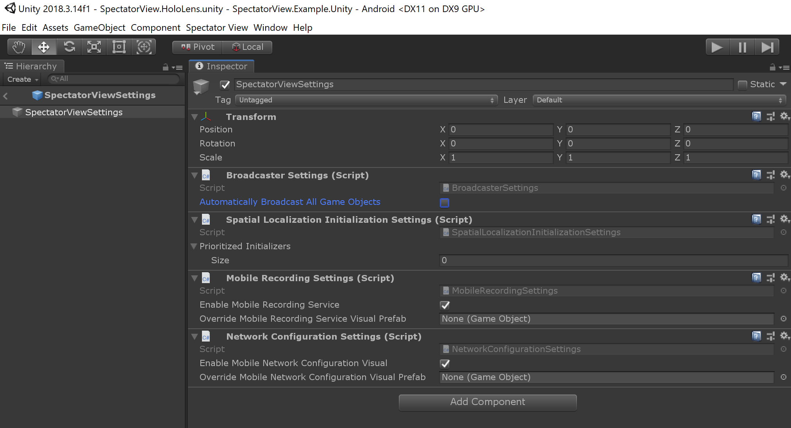
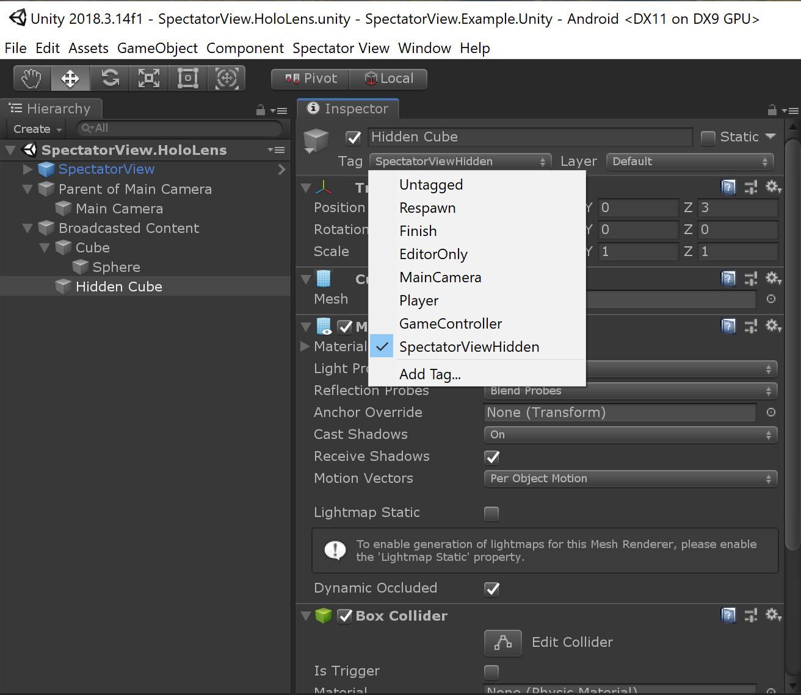
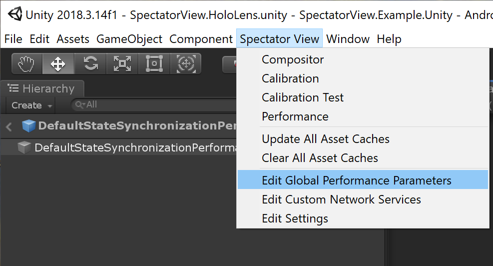
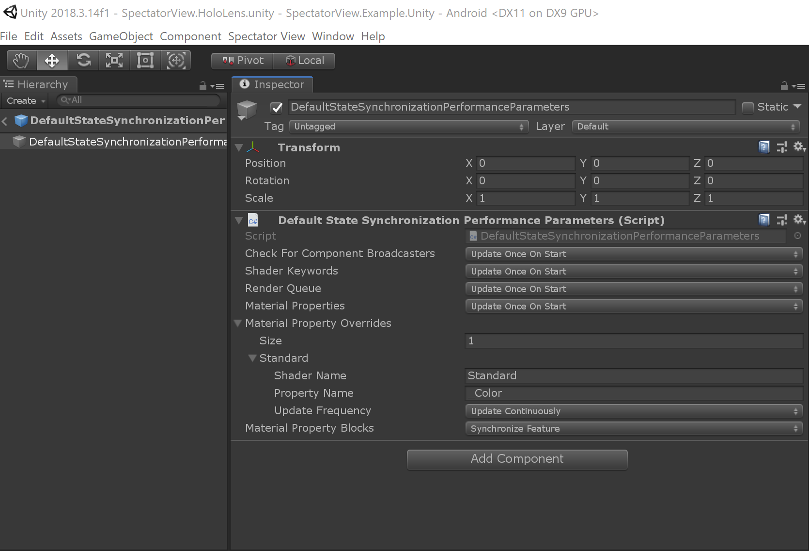
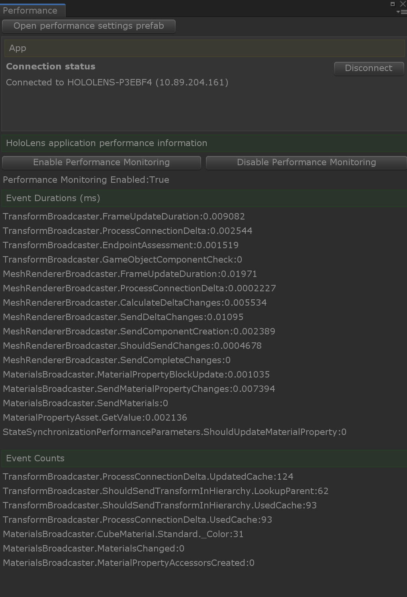
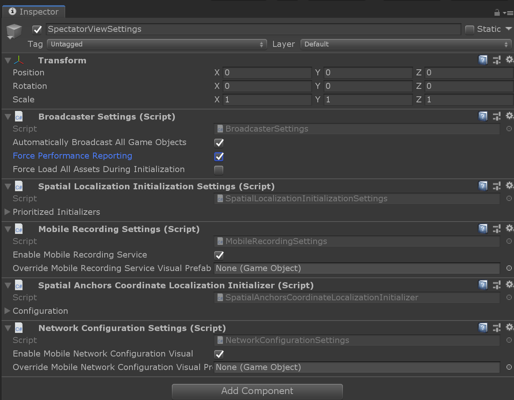
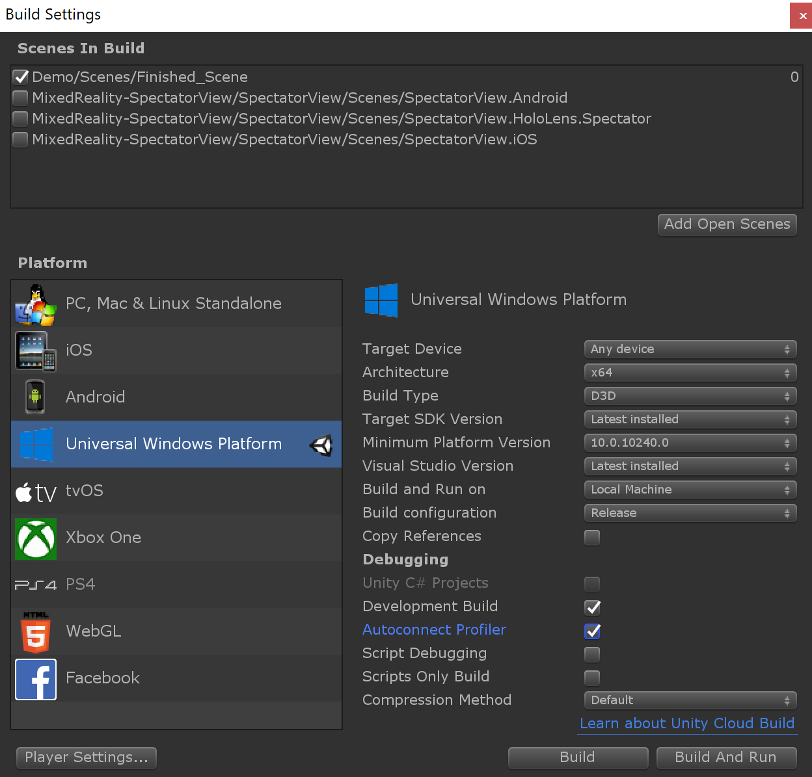

# State synchronization

## Pre-compilation
1) If you would like to synchronize Text Mesh Pro UI, you will need to add the `STATESYNC_TEXTMESHPRO` preprocessor directive to your UWP, Android and iOS Player settings (This is located via Build Settings -> Player Settings -> Other Settings -> 'Scripting Defined Symbols').

2) All of the assets in the unity project need to be assigned unique identifiers. This allows content in the user's application scene to be recreated/updated/destroyed dynamically in the spectator's application scene. This is done through calling `Spectator View -> Update All Asset Caches` in the Unity toolbar prior to compiling the application.

> Note: Adding, updating and removing assets will require updating these asset caches as well as re-compiling each platform.

## Performance

### Performance Settings
State Synchronization comes at a computational cost to your HoloLens application. Every update, ComponentBroadcasters assess whether or not their associated content has updated in order to report changes to spectator devices. The more GameObjects you have in your scene, the more expensive content becomes to assess and synchronize. However, Spectator View does offer some built in functionality to try and help improve performance:

1) In your BroadcasterSettings (Spectator View -> Edit Settings), you can choose to **not** `Automatically Broadcast All Game Objects`. By unselecting this option, you can manually add GameObjectHierarchyBroadcaster components to the root GameObjects of the content in your scene that you care about synchronizing. The less content you choose to synchronize, the less performance drop you should see for your application.

2) In addition to specifically tagging what content to synchronize with GameObjectHierarchyBroadcasters, you can hide content from synchronization by adding `SpectatorViewHidden` and `SpectatorViewChildrenHidden` tags.

3) You can also edit how frequently some content is assessed for changes. There are a couple of ways to do this, but the first method is to edit your global performance parameters:

Then change the polling frequency for some different settings:

* **Check For Component Broadcasters** - Affects how often a game object is assessed for new components/new component broadcasters. If you dynamically add components to your GameObject, you may need to keep this value as `Update Continuously`. If most of your GameObject components are created through a prefab or when creating the GameObject, you may be able to improve performance by setting this value to `Update Once on Start`
* **Shader Keywords** - Affects how frequently shader keywords are assessed. If you never change shader keywords after material creation, changing this value to `Update Once on Start` should improve performance.
* **Material Properties** - Affects how frequently material properties are assessed. If you never change material properties after material creation, changing this value to `Update Once on Start` should improve performance.
* **Material Property Overrides** - Allows custom assessment behavior for custom material properties. If you only have one or a few material properties that are continually updated, you can specify it here and change the **Material Properties** flag to once on start to improve performance. This will result in only the material properties you have declared getting assessed for changes after start.

In addition to changing polling frequencies, you can also enable/disable another setting:
* **Material Property Blocks** - Enables/disables using material property blocks. Material property blocks can be used when you have different properties for the same shared material for different GameObjects. If you aren't using material property blocks, you will not need to enable this functionality.

4) You can also define custom StateSynchronizationPerformanceParameters components for specific GameObjects/portions of your scene. Custom StateSynchronizationPerformanceParameters override the global performance settings for the GameObject that they are attached to, as well as for all child GameObjects. This can allow for finer tuning/tagging specific content in the scene to have different performance parameters for synchronizing.

### Performance Monitoring
Spectator View provides some functionality for performance monitoring/assessing where the largest state synchronization bottlenecks are in your scene. To begin performance monitoring, open the `SpectatorViewPerformance` scene. Enter playmode, and then connect to the HoloLens device running your application through the performance window. Content in the editor scene will be updated to contain the content synchronized by your HoloLens device. By pressing `Enable Performance Monitoring`, your HoloLens will start reporting different content synchronization event durations (Note: this impacts performance, so turn off performance monitoring after assessing the biggest bottlenecks).

Event durations will vary based on the content you have defined in your scene. When working on improving performance in your application, consider the following:

1) A transform broadcaster is created for every GameObject that you synchronize in your scene hierarchy. If you have a lot of empty game objects, consider removing them/flattening your scene hierarchy to decrease the number of transform broadcasters created. This will decrease the performance costs/event durations associated with transform broadcasters. 
2) When you leave all of the options as `Update Continuously` in the global performance settings, you will see material property updates reported in the Event Count section of the performance window. Viewing material updates here may better inform what material properties to declare in the `Material Property Overrides` within your global performance settings when changing `Material Properties` to only `Update Once on Start`.

### Profiling Performance Bottlenecks
Spectator View state synchronization component events can be viewed in the Unity Profiler. This can help generate a better understanding of the frame by frame impact associated with state synchronization. To have Spectator View events appear in the profiler, do the following:

1) Open `Spectator View -> Edit Settings` and check `Force Performance Reporting`.

2) Create a `Development Build` with `Autoconnect Profiler` enabled. This will allow the Unity Profiler window to attach to your device. (For more information on Unity Profiler, including prerequisite setup steps, check out the [Unity documentation](https://docs.unity3d.com/2018.2/Documentation/Manual/windowsstore-profiler.html).

## Application Flow
1) On the user device, a `StateSynchronizationBroadcaster` is enabled, while on the spectator device a 
`StateSynchronizationObserver` is enabled.
    * These classes are responsible for delegating both network messages and network changes to the `StateSynchronizationSceneManager`, which drives scene state synchronization.
    * These classes are used to relay camera location, application time, and performance data from the user to spectator device.
    * These classes allow other components to register for custom network events and send network messages through the `CommandRegistry` (Note: this allows Spatial Alignment components to use the same network connection).

2) In both the user and spectator application, `ComponentBroadcasterServices` register with the `StateSynchronizationSceneManager`.
      * `ComponentBroadcasterServices` specify `ComponentBroadcaster` types for in scene class types. This allows broadcasters to be created as new components are added to the user application scene.
      * `ComponentBroadcasterServices` also register for a specific id so that they can receive network messages and create ComponentObservers in the spectator scene.

3) When the `StateSynchronizationBroadcaster` observes that a `StateSynchronizationObserver`
 has connected, the user's scene is configured to be broadcasted. Configuring the user scene for broadcasting requires adding TransformBroadcasters to root game objects of content that is intended to be synchronized. This can be achieved through different manners:
      * `GameObjectHierarchyBroadcaster` items in the Unity scene will add a `TransformBroadcaster` to their associated game object.
      * If `BroadcasterSettings.AutomaticallyBroadcastAllGameObjects` is set to true, a `TransformBroadcaster` will be added to the root game object of every scene (This is DISABLED by default in SpectatorView).

4) On awake and for every related hierarchy change, the `TransformBroadcaster`
 will ensure that all of its children also have `TransformBroadcasters`. On creation, `TransformBroadcasters` also make sure that their associated game objects have `ComponentBroadcasters` created for all components with registered `ComponentBroadcasterServices`. This effectively sets up the classes needed for components in the user application to broadcast state information to spectator devices.

5) After each frame on the user device, the `StateSynchronizationSceneManager` will monitor network connection changes. It also determine if any `ComponentBroadcasters`
 have been destroyed. It then hands all of the known network connections to each `ComponentBroadcaster`
 so that state information can be sent to the spectator devices.

6) On the spectator device, the `StateSynchronizationSceneManager` will receive network messages to relay to the appropriate `ComponentBroadcasterServices`. These messages signal component creation, updates and destruction on the users device. This component state information also contains unique component ids that allow specific instances of `ComponentBroadcasters`
 on the user device to map 1:1 with specific instances of `ComponentObservers` on the spectator device. Through this state information, the spectator device's scene is updated to reflect content on the user's device.
